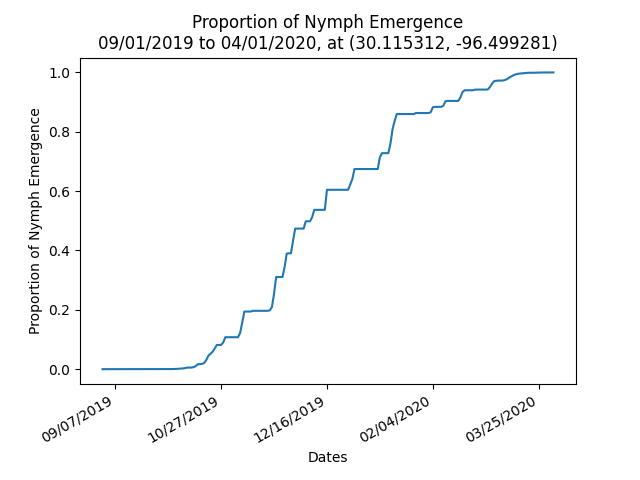
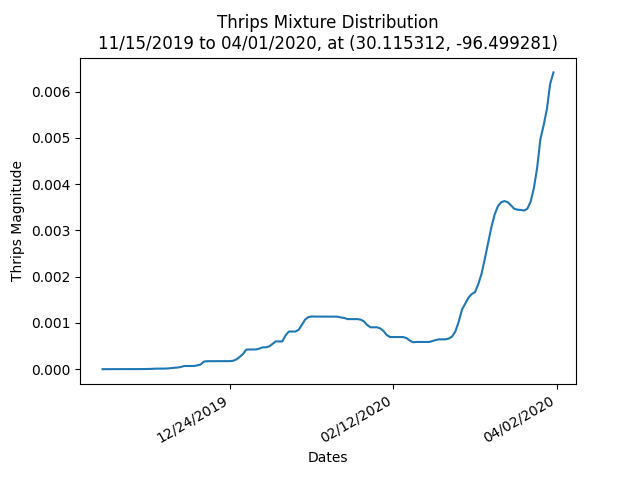

# PRISM Data Tests
This project is a test messing with PRISM data. The main.py uses a formula given to me by Manjari and Tom.
I honestly don't remember the formula. The formula is for cotton flea hopper emergence over time.
In order for their populations to start emerging a certain amount of temperature has to be accumulated.


## Getting PRISM Data
The main.py files expects a directory called `daily-data` to be in the same directory.
daily-data should contain directories in the format of `PRISM_tmean_stable_4kmD2_20200109_bil`.
Where tmean means that the data is for mean temp, 4km is the size of data grid chunks, 2020 is the year, 01 is the month and 09 is the day. 
You can manually download the data from the [PRISM FTP server](https://ftp.prism.oregonstate.edu/daily/tmean/).

I created a helper script to download the data and extract it for you. although I think there was bug when you choose more than one year to download the data for.
> Note: the script is meant to run in a linux environment

## Dependencies
`main.py` depends on
- [rasterio](https://rasterio.readthedocs.io/en/latest/index.html) - used to decode the .bil data format used by PRISM
- - [GDAL](https://gdal.org/) - is what actually decodes the data. rasterio is just a nice wrapper for it
- [matplotlib](https://matplotlib.org/) - used to graph
- [numpy](https://numpy.org/) - used for calculations

The `download-data.sh` needs
- [wget](https://www.gnu.org/software/wget/)

>Note: If you need any help you can reach me at edwinmirandat@gmail.com

---
## Setting up Python `virtualenv`
These commands should be run in a linux environment.

`virtualenv` is used to manage Python packages for different projects. Using `virtualenv` allows you to avoid installing Python packages globally which could break system tools or other projects.Run the following commands to setup and activate `virtualenv`. If you have already created a `virtualenv` before (verify by checking if you have a `venv` folder), you can skip the first command.
```
python3 -m venv venv						# creates virtualenv
source venv/bin/activate					# activates virtualenv
pip install -r requirements.txt				# installs python packages needed for this project
```
To deactivate or leave the virtual environment, run `deactivate`.

## Downloading PRISM Data
Instead of using the `download-data.sh` script, the `setup.py` will be used to retrieve PRISM data. The `setup.py` first cleans out the `daily-data` folder then downloads the PRISM daily mean temperature from the specified start date to end date using the [pyPRISMClimate](https://sdtaylor.github.io/pyPRISMClimate/) python library. Depending on how many files are in the folder and the range of start date to end date, expect possible timeouts and a long download time (around 10 to 20 minutes). All the downloaded data can be found in the `daily-data` folder. This data will be used in `fleahoppers.py` and `thrips.py`. The `setup.py` file also contains functions that can be used in `fleahoppers.py` and `thrips.py`:
- `get_start_date()`: returns start date in datetime format
- `get_end_date()`: returns start date in datetime format
- `get_folder_name()`: returns folder name that will hold all the PRISM climate data
- `get_longitude()`: returns longitude value
- `get_latitude()`: returns latitude value

## Configuration Values
Values for start date, end date, folder name, longitude, and latitude are all hardcoded and can be changed depending on user needs. The `setup.py` file only needs to be run once or after every change to start or end date. There will be no need to run it again if folder name, longitude, or latitude values are changed.

## Running Models
To run `setup.py`, run `python3 setup.py`. As noted earlier, depending on the amount of files in the `daily-data` folder and date range, expect a long running time of around 10 to 20 minutes. To run the fleahoppers model, run `python3 fleahoppers.py`. This will generate an image file of a graph of Proportion of Nymph Emergence. The file will be called `fleahoppers.png`. To run the thrips mode, run `python3 thrips.py`. This will generate an image file of a graph of Thrips Magnitude. The file will be called `thrips.png`.

## Sample Graph Output
### Using data from September 1, 2019 to April 1, 2020 at (30.115312, -96.499281)
Sample graph output after running fleahoppers model: <br>


Sample graph output after running thrips model: <br>
